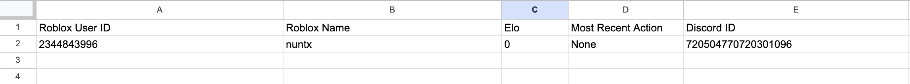

# roblox-elo-bot

Clone repository:

```
https://github.com/mikewakeham/roblox-elo-bot
```

Navigate to directory:

```
cd roblox-elo-bot
```

Install dependencies:

```
pip install -r requirements.txt
```

It is recommended to have an IDE such as Visual Studio Code to edit and run the bot.py file

# Syncing with google sheets API

1. Go to google API website [https://console.cloud.google.com/](https://console.cloud.google.com/)
2. In the top left corner, select "Select a project" then "NEW PROJECT"
3. Enter any name for the project name (e.g., "elo bot") then select "CREATE"
4. Now go back to the top left corner, select "Select a project" again and then click on the project you created
5. On the left sidebar, select "APIs & Services" > "Enabled APIs & services" > "ENABLE APIS AND SERVICES"
6. Scroll down and find "Google Drive API" and "Google Sheets API" click on both and press enable for both
7. On the left sidebar, select "APIs & Services" > "Credentials" > "CREATE CREDENTIALS" > "Service Account"
8. Give it any name (e.g., "elo bot") and leave the automatically generated ID (e.g., "elo-bot"), then press "CREATE AND CONTINUE"
9. On the "Select a role" dropdown, select either "Owner" or "Editor" and then press DONE
10. Return to the "Credentials" tab and then copy the email under "Service Accounts"

Now create a google sheets with the following format for columns.

*The names of each column are both case and space sensitive, so copy it exactly*



11. Share the sheets to the copied service account email and grant it Editor permissions
12. Now select the email under "Service Accounts", then go to the "KEYS" tab
13. Press "ADD KEY" > "Create new key" > "JSON" > "CREATE", this should automatically download the .json file to your computer
14. Now place this .json file in this same working directory/folder
15. Inside the bot.py file at line 15, replace "GOOGLE API CREDENTIALS JSON FILE HERE" with the name of the .json file, keeping the quotation marks
```
(Line 15): creds = ServiceAccountCredentials.from_json_keyfile_name("GOOGLE API CREDENTIALS JSON FILE HERE", scope)
```

# Discord API

1. Go to discord API website [https://discord.com/developers/applications](https://discord.com/developers/applications)
2. Select "New Application" then enter the name and select "Create"
3. On the left sidebar, navigate to "Bot" and turn on
   - "PUBLIC BOT"
   - "PRESENCE INTENT"
   - "SERVER MEMBERS INTENT"
   - "MESSAGE CONTENT INTENT"
4. For bot permissions, select "Administrator" and save changes
5. To get your API token, stay on the Bot tab and press the "RESET TOKEN" button to get your token
6. Copy the token and paste it into the last line of the bot.py file where it says "DISCORD API TOKEN HERE"

```
bot.run("DISCORD API TOKEN HERE")
```
   
8. To add the bot to your server, first navigate to the OAuth2 tab on the left sidebar
9. Go to the URL Generator and select "applications.commands" and "bot", then "Administrator" under "BOT PERMISSIONS"
10. Now copy the url link, paste it into your tab and add it to your server

Now you can run the python file with the google sheets API file and discord API file to turn on the bot.
